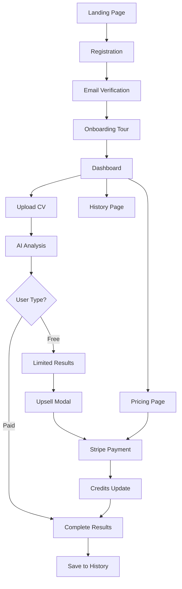

# Requisiti Prodotto: CV Analyzer SaaS Platform

## 1. Product Overview

Trasformazione dell'attuale analizzatore CV React in una piattaforma SaaS completa che permette a candidati, career coach e recruiter di valutare e ottimizzare CV utilizzando AI avanzata.

L'obiettivo è ridurre i tempi di revisione, aumentare le possibilità di superare i sistemi ATS e fornire feedback personalizzati di alta qualità attraverso un modello di business pay-per-use sostenibile.

La piattaforma mira a diventare il punto di riferimento per l'ottimizzazione CV nel mercato italiano ed europeo.

## 2. Core Features

### 2.1 User Roles

| Role        | Registration Method             | Core Permissions                                         |
| ----------- | ------------------------------- | -------------------------------------------------------- |
| Free User   | Email registration con verifica | 1 analisi gratuita limitata, accesso dashboard base      |
| Paying User | Upgrade tramite Stripe          | Analisi complete illimitate, cronologia completa, export |

### 2.2 Feature Module

La piattaforma SaaS è composta dalle seguenti pagine principali:

1. **Landing Page**: hero section con value proposition, pricing overview, call-to-action registrazione
2. **Authentication Pages**: login, registrazione, verifica email, reset password
3. **Onboarding Tour**: 3 slide guidate per spiegare funzionalità principali
4. **Dashboard**: overview crediti, CTA upload CV, navigazione rapida, statistiche utilizzo
5. **CV Analysis**: upload con drag-and-drop, validazioni, processing, risultati con upsell
6. **History & Management**: cronologia CV analizzati, gestione file, export, versioning
7. **Pricing & Payment**: piani disponibili, checkout Stripe, gestione abbonamenti

### 2.3 Page Details

| Page Name      | Module Name        | Feature description                                                             |
| -------------- | ------------------ | ------------------------------------------------------------------------------- |
| Landing Page   | Hero Section       | Value proposition chiara, benefici AI analysis, testimonials, CTA registrazione |
| Landing Page   | Pricing Preview    | Overview piani (gratuito vs pay-per-use), trasparenza costi, FAQ                |
| Authentication | Login/Register     | Supabase Auth integration, email/password, social login (Google, LinkedIn)      |
| Authentication | Email Verification | Processo verifica obbligatoria, resend email, stato account                     |
| Onboarding     | Guided Tour        | 3 slide interattive: upload CV, analisi AI, risultati e crediti                 |
| Dashboard      | Credits Overview   | Visualizzazione crediti rimanenti, stato account, usage statistics              |
| Dashboard      | Quick Actions      | CTA principale upload CV, accesso rapido cronologia, settings                   |
| Dashboard      | Navigation Menu    | Menu laterale/top: dashboard, cronologia, pricing, profilo, logout              |
| CV Analysis    | File Upload        | Drag-and-drop, file picker, validazioni (5MB max, PDF only, single file)        |
| CV Analysis    | Processing         | Loading states, progress indicator, webhook integration esistente               |
| CV Analysis    | Results Display    | Analisi limitata (free) vs completa (paid), punteggi ATS, suggerimenti          |
| CV Analysis    | Upsell Modal       | Modal dinamico quando crediti esauriti, pricing, redirect Stripe                |
| History        | CV List            | Lista CV analizzati, metadata (data, nome, tipo analisi), search/filter         |
| History        | File Management    | Rinomina, duplica, elimina CV, download PDF, export risultati JSON              |
| History        | Version Control    | Accesso versioni precedenti analisi, confronto risultati                        |
| Pricing        | Plans Overview     | Dettaglio piani, feature comparison, FAQ, testimonials                          |
| Pricing        | Stripe Checkout    | Integrazione Stripe Elements, payment processing, webhook handling              |
| Profile        | Account Settings   | Gestione profilo utente, preferenze, change password, delete account            |
| Profile        | Billing History    | Cronologia pagamenti, fatture, gestione metodi pagamento                        |

## 3. Core Process

### 3.1 User Registration & Onboarding Flow

1. Utente accede alla landing page
2. Click su "Registrati" → form registrazione con email/password
3. Supabase invia email di verifica
4. Utente clicca link verifica → account attivato
5. Primo login → tour guidato 3 slide
6. Redirect alla dashboard con 1 credito gratuito

### 3.2 CV Analysis Flow (Free User)

1. Dashboard → click "Carica CV"
2. Upload PDF con validazioni client-side
3. Invio al webhook AI esistente
4. Risultati limitati: solo ATS score + 1 forza + 1 criticità
5. Modal upsell per analisi completa
6. Salvataggio in cronologia con flag "limited"

### 3.3 Payment & Upgrade Flow

1. Modal upsell o pagina pricing
2. Selezione piano pay-per-use (5€)
3. Redirect Stripe Checkout
4. Pagamento completato → webhook Stripe
5. Aggiornamento crediti database
6. Unlock analisi completa + 1 credito extra
7. Redirect dashboard con conferma

### 3.4 CV Analysis Flow (Paying User)

1. Dashboard → click "Carica CV"
2. Upload PDF con validazioni
3. Invio webhook AI
4. Risultati completi: tutti i punteggi, analisi dettagliata, suggerimenti
5. Salvataggio cronologia con metadata completi
6. Decremento crediti automatico



## 4. User Interface Design

### 4.1 Design Style

* **Colori Primari**:

  * Primary: #3B82F6 (Blue-500)

  * Secondary: #1E293B (Slate-800)

  * Accent: #10B981 (Emerald-500)

  * Error: #EF4444 (Red-500)

  * Warning: #F59E0B (Amber-500)

* **Tipografia**:

  * Font principale: Inter, system-ui, sans-serif

  * Dimensioni: 14px base, 16px body, 24px+ headings

  * Peso: 400 regular, 500 medium, 600 semibold, 700 bold

* **Stile Componenti**:

  * Bottoni: rounded-lg, shadow-sm, hover states

  * Cards: rounded-xl, backdrop-blur, border subtle

  * Inputs: rounded-lg, focus ring, validation states

* **Layout**:

  * Design mobile-first responsive

  * Grid system 12 colonne

  * Sidebar navigation desktop, bottom nav mobile

  * Container max-width 1200px

* **Icone**:

  * Heroicons per consistenza

  * 20px/24px standard sizes

  * Outline style default, solid per stati attivi

### 4.2 Page Design Overview

| Page Name    | Module Name      | UI Elements                                                                  |
| ------------ | ---------------- | ---------------------------------------------------------------------------- |
| Landing Page | Hero Section     | Gradient background, large typography, animated CTA button, hero image/video |
| Landing Page | Pricing Cards    | 3-column layout, feature comparison table, highlight popular plan            |
| Dashboard    | Credits Widget   | Circular progress indicator, color-coded status, prominent display           |
| Dashboard    | Quick Actions    | Large upload area, recent files grid, action buttons with icons              |
| CV Analysis  | Upload Zone      | Dashed border, drag states, file preview, progress indicators                |
| CV Analysis  | Results          | Tabbed interface, score visualizations, expandable sections                  |
| History      | File Grid        | Card layout, thumbnail previews, action menus, search bar                    |
| Pricing      | Comparison Table | Feature matrix, toggle annual/monthly, testimonials sidebar                  |

### 4.3 Responsiveness

Design mobile-first con breakpoints:

* Mobile: 320px-768px (stack layout, bottom navigation)

* Tablet: 768px-1024px (hybrid layout, collapsible sidebar)

* Desktop: 1024px+ (full sidebar, multi-column layouts)

Touch optimization per mobile con target size 44px minimum, swipe gestures per navigation.

## 5. Technical Architecture

### 5.1 Frontend Stack

* **Framework**: React 19+ con TypeScript

* **Build Tool**: Vite per development e build

* **Styling**: Tailwind CSS per utility-first design

* **State Management**: React Context + useReducer per stato globale

* **Routing**: React Router v6 per SPA navigation

* **Forms**: React Hook Form + Zod validation

* **HTTP Client**: Fetch API con custom hooks

### 5.2 Backend Services

* **Authentication**: Supabase Auth (email/password, OAuth)

* **Database**: Supabase PostgreSQL

* **File Storage**: Supabase Storage per PDF files

* **Payments**: Stripe Checkout + webhooks

* **AI Processing**: Webhook n8n esistente (mantenuto)

### 5.3 Database Schema

```sql
-- Users (gestito da Supabase Auth)
-- Estensione con profilo custom
CREATE TABLE user_profiles (
  id UUID REFERENCES auth.users PRIMARY KEY,
  credits INTEGER DEFAULT 1,
  subscription_status TEXT DEFAULT 'free',
  created_at TIMESTAMP DEFAULT NOW(),
  updated_at TIMESTAMP DEFAULT NOW()
);

-- CV Analysis Records
CREATE TABLE cv_analyses (
  id UUID PRIMARY KEY DEFAULT gen_random_uuid(),
  user_id UUID REFERENCES user_profiles(id),
  file_name TEXT NOT NULL,
  file_path TEXT NOT NULL,
  analysis_type TEXT DEFAULT 'limited', -- 'limited' | 'complete'
  results JSONB NOT NULL,
  job_description TEXT,
  created_at TIMESTAMP DEFAULT NOW()
);

-- Payment Records
CREATE TABLE payments (
  id UUID PRIMARY KEY DEFAULT gen_random_uuid(),
  user_id UUID REFERENCES user_profiles(id),
  stripe_payment_id TEXT UNIQUE NOT NULL,
  amount INTEGER NOT NULL, -- in cents
  credits_added INTEGER NOT NULL,
  status TEXT DEFAULT 'pending',
  created_at TIMESTAMP DEFAULT NOW()
);
```

### 5.4 API Integration

**Supabase Client Setup**:

```typescript
interface UserProfile {
  id: string;
  credits: number;
  subscription_status: 'free' | 'paid';
}

interface CVAnalysis {
  id: string;
  user_id: string;
  file_name: string;
  analysis_type: 'limited' | 'complete';
  results: AnalysisResult;
  created_at: string;
}
```

**Stripe Integration**:

* Stripe Checkout per pagamenti one-time

* Webhook endpoint per payment.succeeded

* Automatic credits update via database trigger

**AI Webhook (Existing)**:

* Mantiene endpoint n8n esistente

* Aggiunge header user\_id per tracking

* Response filtering basato su analysis\_type

### 5.5 Security & Performance

* **Authentication**: JWT tokens via Supabase

* **Authorization**: Row Level Security (RLS) policies

* **File Upload**: Client-side validation + server-side verification

* **Rate Limiting**: Supabase built-in + custom logic

* **Caching**: React Query per API responses

* **Error Handling**: Global error boundary + toast notifications

## 6. Monetization Strategy

### 6.1 Pricing Model

**Free Tier**:

* 1 analisi gratuita per nuovo utente

* Output limitato: solo ATS score + 1 forza + 1 criticità

* Accesso cronologia limitato (solo ultimo CV)

**Pay-per-Use**:

* 5€ per analisi completa

* Include 1 credito extra (totale 2 analisi complete)

* Accesso completo a tutte le funzionalità

* Cronologia illimitata con export

### 6.2 Upsell Strategy

* Modal dinamico dopo analisi gratuita

* Highlight benefici analisi completa

* Social proof e testimonials

* Urgency messaging ("Sblocca ora")

* Clear value proposition (ROI del CV ottimizzato)

### 6.3 Future Expansion

* Subscription plans (mensili/annuali)

* Team/Enterprise features

* Advanced AI models

* Industry-specific analysis

* CV builder integration

## 7. Implementation Roadmap

### Phase 1: Foundation (Week 1-2)

* Supabase setup e configurazione

* Authentication system implementation

* Database schema e RLS policies

* Basic dashboard structure

### Phase 2: Core Features (Week 3-4)

* CV upload con validazioni

* AI integration con credit system

* Results display con limited/complete logic

* Basic history functionality

### Phase 3: Monetization (Week 5-6)

* Stripe integration

* Payment flow e webhooks

* Upsell modals

* Credits management

### Phase 4: Polish & Launch (Week 7-8)

* UI/UX refinements

* Performance optimization

* Testing e bug fixes

* Documentation e deployment

## 8. Success Metrics

* **User Acquisition**: Registrazioni giornaliere/settimanali

* **Conversion Rate**: Free → Paid user conversion

* **Revenue**: MRR (Monthly Recurring Revenue)

* **Engagement**: CV uploads per utente, retention rate

* **Product**: Tempo medio analisi, user satisfaction score

## 9. Risk Mitigation

* **Technical**: Backup webhook AI, fallback UI states

* **Business**: Pricing flexibility, feature toggles

* **Legal**: GDPR compliance, terms of service

* **Operational**: Monitoring, error tracking, support system

